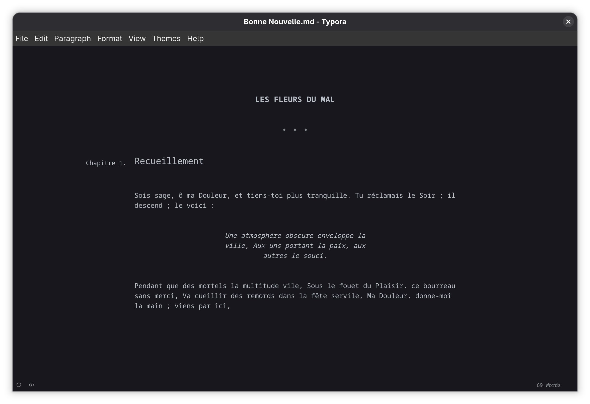
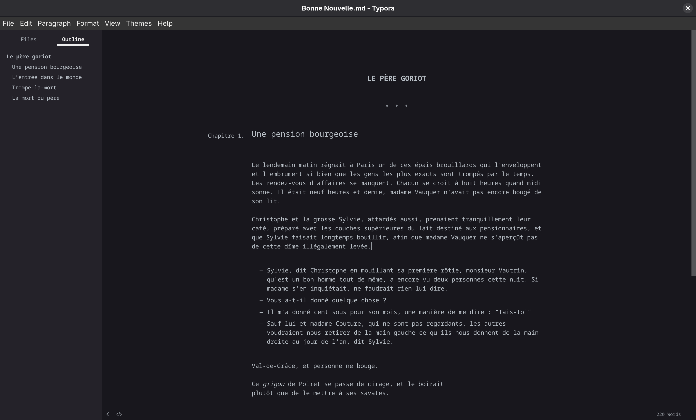
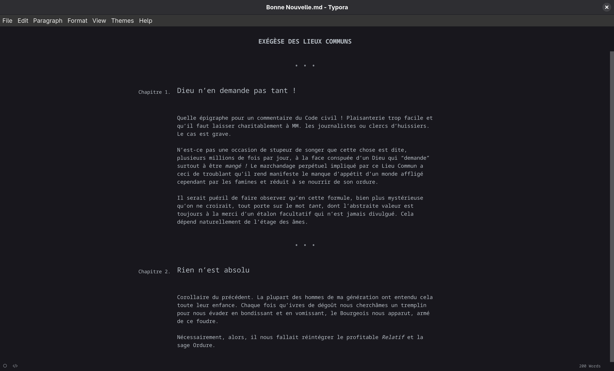

# Bonne nouvelle

*Bonne nouvelle* est un thème Typora épuré, pensé pour l’écriture de romans et de nouvelles.

## Installation

Copier simplement `bonne-nouvelle.css` dans `~/.config/Typora/themes`.

## Exemples

```md
# Les fleurs du mal
## Recueillement

Sois sage, ô ma Douleur, et tiens-toi plus tranquille. Tu réclamais le Soir ; il descend ; le voici :

> Une atmosphère obscure enveloppe la ville, Aux uns portant la paix, aux autres le souci.

Pendant que des mortels la multitude vile, Sous le fouet du Plaisir, ce bourreau sans merci, Va cueillir des remords dans la fête servile, Ma Douleur, donne-moi la main ; viens par ici,
```



```md
# Le père goriot
## Une pension bourgeoise

Le lendemain matin régnait à Paris un de ces épais brouillards qui l'enveloppent et l'embrument si bien que les gens les plus exacts sont trompés par le temps. Les rendez-vous d'affaires se manquent. Chacun se croit à huit heures quand midi sonne. Il était neuf heures et demie, madame Vauquer n'avait pas encore bougé de son lit.

Christophe et la grosse Sylvie, attardés aussi, prenaient tranquillement leur café, préparé avec les couches supérieures du lait destiné aux pensionnaires, et que Sylvie faisait longtemps bouillir, afin que madame Vauquer ne s'aperçût pas de cette dîme illégalement levée.

- Sylvie, dit Christophe en mouillant sa première rôtie, monsieur Vautrin, qu'est un bon homme tout de même, a encore vu deux personnes cette nuit. Si madame s'en inquiétait, ne faudrait rien lui dire.
- Vous a-t-il donné quelque chose ?
- Il m'a donné cent sous pour son mois, une manière de me dire : "Tais-toi"
- Sauf lui et madame Couture, qui ne sont pas regardants, les autres voudraient nous retirer de la main gauche ce qu'ils nous donnent de la main droite au jour de l'an, dit Sylvie.

Val-de-Grâce, et personne ne bouge.

Ce *grigou* de Poiret se passe de cirage, et le boirait
plutôt que de le mettre à ses savates.

## L’entrée dans le monde
...

## Trompe-la-mort
...

## La mort du père
...
```



```md
# Exégèse des lieux communs
## Dieu n’en demande pas tant !

Quelle épigraphe pour un commentaire du Code civil ! Plaisanterie trop facile et qu’il faut laisser charitablement à MM. les journalistes ou clercs d’huissiers. Le cas est grave.

N’est-ce pas une occasion de stupeur de songer que cette chose est dite, plusieurs millions de fois par jour, à la face conspuée d’un Dieu qui "demande" surtout à être *mangé !* Le marchandage perpétuel impliqué par ce Lieu Commun a ceci de troublant qu’il rend manifeste le manque d’appétit d’un monde affligé cependant par les famines et réduit à se nourrir de son ordure.

Il serait puéril de faire observer qu’en cette formule, bien plus mystérieuse qu’on ne croirait, tout porte sur le mot *tant*, dont l’abstraite valeur est toujours à la merci d’un étalon facultatif qui n’est jamais divulgué. Cela dépend naturellement de l’étage des âmes. 

## Rien n’est absolu

Corollaire du précédent. La plupart des hommes de ma génération ont entendu cela toute leur enfance. Chaque fois qu’ivres de dégoût nous cherchâmes un tremplin pour nous évader en bondissant et en vomissant, le Bourgeois nous apparut, armé de ce foudre.

Nécessairement, alors, il nous fallait réintégrer le profitable *Relatif* et la sage Ordure.
```



## References

This theme is largely based on Typora’s built-in "Night" theme.

It was also inspired by the ["Screenplay" theme](https://github.com/pranavgn/Typora-Screenplay-Theme)
by [@pranavgn](https://github.com/pranavgn).